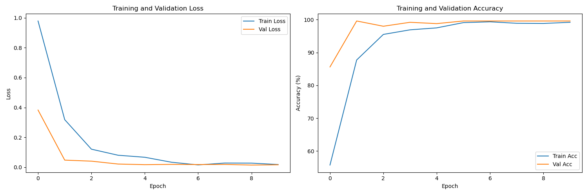
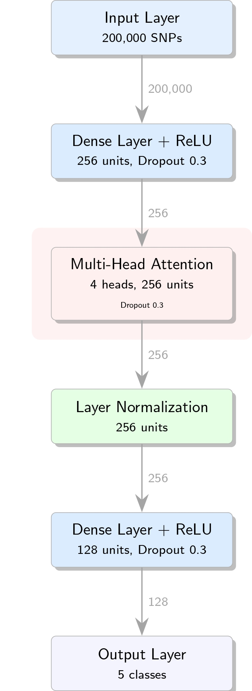

<div align="center">

</div>

Population Predictor is an attention-based deep learning model that predicts human super-population groups from genetic variation data. Using SNP (Single Nucleotide Polymorphism) data from the 1000 Genomes Project, it achieves 98.01% accuracy in classifying individuals into five major population groups: European (EUR), East Asian (EAS), African (AFR), South Asian (SAS), and American (AMR).

For computational efficiency, this implementation uses data from only chromosomes 21 and 22, selecting the 100,000 SNPs with highest variance across individuals from each chromosome. 

## Results

### Test Accuracy by Population
| Population | Accuracy |
|------------|----------|
| EUR        | >99.99%  |
| EAS        | >99.99%  |
| AFR        | 96.97%   |
| SAS        | >99.99%  |
| AMR        | 91.18%   |

### Training Visualisation

While training, a real-time chart displaying loss and accuracy metrics will appear and update after each epoch. This visualisation will be automatically saved to the 'models' directory at the end of training.

<div align="center">

</div>

## Model Architecture

The model combines dense neural networks with multi-head attention, featuring:
- Input transformation through dense layers
- Multi-head self-attention mechanism
- Layer normalisation
- Dropout for regularisation
- Classification head for 5 super-populations
<div align="center">

</div>

## Data Pipeline

### Dataset Composition
Using data from chromosomes 21 and 22:
- Top 100,000 SNPs selected from each chromosome based on variance across individuals
- 200,000 total features per individual
- 2,504 total individuals

### Population Distribution

| Population | Train (80%) |  Validation (10%) | Test (10%) |
|------------|-------------|-------------------|------------|
| EUR        | 402 (20.1%) | 50 (20.0%)       | 51 (20.3%) |
| EAS        | 403 (20.1%) | 50 (20.0%)       | 51 (20.3%) |
| AFR        | 529 (26.4%) | 66 (26.4%)       | 66 (26.3%) |
| SAS        | 391 (19.5%) | 49 (19.6%)       | 49 (19.5%) |
| AMR        | 278 (13.9%) | 35 (14.0%)       | 34 (13.5%) |
| **Total**  | 2003        | 250              | 251        |

### Feature Selection
For each chromosome, the code:
1. Converts genotype data to binary format (presence/absence of alternative alleles)
2. Calculates variance of each SNP across all individuals
3. Selects the top 100,000 SNPs with highest variance
4. Combines selected SNPs from both chromosomes

My intuition was to focus on the model on the most variable genetic markers which we hypothesised to be the more informative. Further research is required to determine if there is a most optimal strategy. 

## Installation

1. Clone the repository:
```bash
git clone https://github.com/rossheat/population_predictor.git
cd population_predictor
```

2. Create conda environment:
```bash
conda env create -f env.yml
conda activate population_predictor
```

## Usage

**1. Download data**:
```bash
python scripts/download_data.py --chromosomes 21 22
```

**2. Preprocess data:**
```bash
python scripts/preprocess_data.py --chromosomes 21 22 --max-snps 100000
```

**3. Train model:**
```bash
python scripts/train_test_model.py --chromosomes 21 22 --epochs 10
```

The best performing model (based on validation accuracy), will be automatically saved to the 'models' directory at the end of training.

The model will automatically use GPU if available through PyTorch's CUDA detection.

**4. Make predictions for individual samples:**
```bash
python scripts/predict_one.py --model models/model_chr21-22.pt --data data/preprocessed/chromosome_21-22.npz --sample-idx 0
```

Example output:
```
Predicted super-population: EUR

Probabilities:
EUR: 0.9990
AMR: 0.0008
SAS: 0.0001
AFR: 0.0000
EAS: 0.0000
```

## Citation

If you use this code or the 1000 Genomes Project data, please cite:

```bibtex
@article{1000genomes2015,
  title={A global reference for human genetic variation},
  author={{The 1000 Genomes Project Consortium}},
  journal={Nature},
  volume={526},
  number={7571},
  pages={68--74},
  year={2015},
  publisher={Nature Publishing Group}
}
```

## License

This project is licensed under the GNU General Public License v3.0